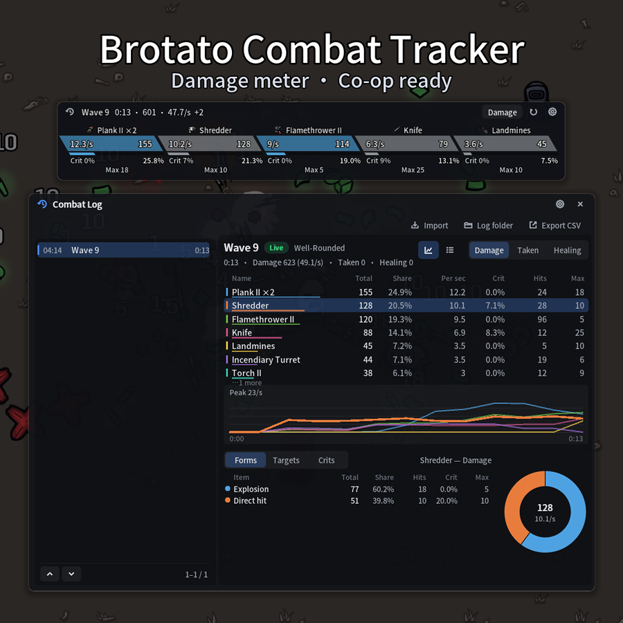

# Brotato Combat Tracker

[简体中文](README.md) | **English**

A combat statistics panel for **Brotato**. A horizontal overlay that breaks down damage dealt, damage taken
and healing per weapon and item; click any card for a donut-chart breakdown by hit form, target and crits;
statistics segment automatically per wave; CSV export. An ACT-style combat log window lets you review every
wave and list its individual events, and each session's combat events are saved to a log that can be imported
and re-parsed. Everything can be set up in-game. The UI text follows the game's language.

**Read-only statistics. It never modifies any game value.** Works in vanilla solo, local co-op (up to 4 players)
and with the Workshop co-op mod [BrotatoOnline](https://steamcommunity.com/sharedfiles/filedetails/?id=3741034628).

Currently aligned with game **1.1.15.4** (base game and the Abyssal Terrors DLC), Mod Loader **6.3.0**.



---

## Install

### Steam: subscribe on the Workshop (recommended)

1. Open the [Workshop page](https://steamcommunity.com/sharedfiles/filedetails/?id=3809733696) (or search the Brotato Workshop for **Brotato Combat Tracker**) and click **Subscribe**
2. Launch the game. Newly subscribed mods are enabled by default; you can toggle them under **Mods** in the main menu

The Workshop keeps it up to date for you.

### Other platforms (GOG / Epic)

Download `DPSLove-CombatTracker-vX.Y.Z.zip` from
[Releases](https://github.com/DPS-Love/brotato-combat-tracker/releases/latest) and, **without extracting it**,
put it in the `mods` folder of the game directory (create it if it doesn't exist):

```
Brotato\
├── Brotato.exe
└── mods\
    └── DPSLove-CombatTracker-vX.Y.Z.zip
```

> The Steam version's Mod Loader only loads subscribed Workshop items and ignores the `mods` folder. Steam players, please use the Workshop.

---

## Usage

| Key | Action |
|---|---|
| `F9` | Show / hide the overlay |
| `F8` | Open / close the combat log window |
| `F10` | Reset the current statistics (splits the wave into a new encounter; the old one moves to the combat log) |
| `F11` | Export the current encounter as a CSV |

- Normally only the text (with a black outline) and the cards float over the game; move the cursor onto the overlay
  and its translucent background and title-bar buttons fade in
- Overlay title bar: the log icon on the far left opens the combat log; on the right are the view switch
  (**Damage / Taken / Healing**, plus **Sources / Players** with several players), reset and settings
- **Click a card** for its breakdown window, a donut chart with a legend that scrolls past 7 items:
  - Damage · source: forms (direct hit / burning / explosion / effect), targets (which enemies it hit), crits
  - Damage · player: sources (weapons / items), classes (melee / ranged / elemental / engineering…), targets
  - Taken: sources (which enemies hit you), outcomes (hit / dodged / blocked)
  - Healing: sources (HP regeneration / life steal / items / consumables…)
- Statistics segment per wave with the game's own wave titles, e.g. `Wave 5 · Elite`; replaying a failed wave adds a repeat number, e.g. `Wave 5 #2`
- Identical weapons of the same tier share one card with a count, e.g. `SMG III ×2`
- Every window can be dragged and remembers its position; hover over an icon button for a moment to see what it does

The overlay only shows while a wave is running: it steps aside for the pause menu, the level-up choices after a wave
and the shop, so it never covers the game's own buttons. To look at data between waves press `F8`; the combat log
window opens anywhere. The game hides the mouse during waves, so it's easiest to click the panels while paused.

Damage **excludes overkill** by default (damage beyond the target's remaining HP), matching the game's own weapon
damage counters; turn on "Count overkill" in the settings to count raw damage instead.

### Who gets the credit

| Case | Credited to |
|---|---|
| Weapon hits and weapon projectiles | That weapon |
| Burn ticks | The weapon that set the fire; global burn granted by items counts as Scared Sausage, sourceless engineering burn as Incendiary Turret |
| Explosions | The weapon (Rocket Launcher, Shredder, Plank, Power Fist…) or item (Landmines…) that triggered them |
| Turrets, landmines, pets | The corresponding item |
| Riposte after a dodge | Riposte |
| Damage dealt by charmed enemies | The player who charmed them, labelled "(charmed)" |

These rules follow the game's own bookkeeping; Incendiary Turret and Scared Sausage, for example, are tracked the
same way in the game's own statistics. Damage to trees is excluded by default (config `IncludeTrees`).

### Combat log window

Open it with the log icon at the far left of the overlay's title bar (or `F8`). It is modelled on ACT's main window:

- **Left**: every encounter of this session, newest first; the footer shows which encounters are in view and how many there are
- **Right**: the selected encounter, marked **Live** while it is in progress — a table for Damage / Taken / Healing
  (total, share, per second, crit / dodge, hits, max), grouped by source or by player in co-op; each row's per-second
  curve over time (hover to read any second); and a breakdown table with a donut chart. Click a row to focus on it,
  click it again or any empty space to go back to everyone; breakdown rows and donut slices highlight each other,
  the table scrolls past 8 items, and the small items past the eighth are merged into a grey "Other" slice
- The top-right toggle swaps the lower half for an **event list**: every hit, damage taken and heal of the encounter
  in order (source, target, amount, crit, form), filtered by the current view and the selected row. The live encounter
  follows the newest events; ended encounters and imported logs are read back from the log file
- **Export CSV** at the top exports the selected encounter; **Log folder** opens the folder the logs are kept in

### Settings

The gear in the overlay's or the combat log's title bar opens them: UI scale, card slant, window background opacity,
overlay card count, icons, overlay in the shop, overkill and trees, how many encounters the combat log keeps,
sharing stats online, combat logs, hotkeys and player colours can all be changed there and are saved to the config
file right away. The two items marked "Needs restart" (combat logs) take effect the next time the game starts.

### Combat logs

Every game session writes its combat **events** (each hit, damage taken, heal, wave start and end…) to a log:
`%APPDATA%\Brotato\CombatTracker\logs\bct-date-time.bctlog.gz`, plain gzip, readable line by line once extracted;
kept for 30 days by default.

**Import** in the combat log window opens any of these logs and **re-parses it with the current version**, so
statistics added in later updates also show up for old logs. Logs from other players can be imported too — just put
them in that folder. The format is documented in [combat log format](docs/eventlog.md) (Chinese).

---

## Co-op

- **Local co-op**: every player on the machine is tracked. Card names carry `P1` / `P2`, and the small square in the corner is the player's colour
- **BrotatoOnline (Workshop co-op mod)**: in an online session each machine only simulates its own player's hits,
  so no single machine sees the whole team's damage. Each player therefore tracks their own player and, every
  2 seconds, sends this wave's statistics to the teammates through BrotatoOnline's public mod-message API, plus a
  final version when the wave ends. **You only see a teammate's numbers if they run this mod too**; teammates
  without it simply show nothing, and nobody else is affected. Host and clients behave the same; to opt out,
  turn off "Share stats online" in the settings. The event list only has your own player's events (teammates send totals)
- Teammates' final numbers are written into your own combat log, so importing it later shows the whole team

---

## Configuration

`%APPDATA%\Brotato\CombatTracker\config.cfg` is **created after the game has been launched once**; every entry has a
Chinese and an English description. Everything below can be changed in the in-game settings; if you edit the file
directly, restart the game.

| Setting | Default | Description |
|---|---|---|
| `ToggleOverlay` / `ToggleMainPanel` / `Reset` / `ExportCsv` | F9 / F8 / F10 / F11 | Hotkeys; empty for none |
| `ShowOverlay` | true | Show the overlay at startup |
| `ShowInShop` | false | Also show the overlay in the shop (it shows the wave just finished) |
| `UiScale` | 1.0 | UI scale |
| `SkewDegrees` | -30 | Skew angle of the cards; `0` for plain rectangles |
| `BackgroundOpacity` | 0.9 | Background opacity of the overlay, breakdown and combat log windows (0–1); the overlay shows its background only while the cursor is on it |
| `MaxCards` | 5 | Max cards on the overlay; the rest are counted as `+n` in the title bar |
| `ShowIcons` | true | Show weapon / item icons on the cards |
| `CountOverkill` | false | Count overkill damage |
| `IncludeTrees` | false | Count damage dealt to trees |
| `HistorySize` | 200 | How many encounters of this session the combat log window keeps (older ones stay in the log file); `0` for no limit |
| `LogEvents` | true | Write combat logs; when off, ended encounters have no event list and this session can't be imported |
| `LogRetentionDays` | 30 | Days to keep combat logs; `0` keeps them forever |
| `ShareStats` | true | Exchange statistics with teammates online |

The `[Colors]` section holds the four player colours (the settings offer a set of presets), or write hex values
(`#RGB` / `#RRGGBB`); leave them empty for the game's player colours. Each window writes its own position back.

---

## Uninstall

Unsubscribe on the Workshop (or delete the zip from `mods`). Statistics live in `%APPDATA%\Brotato\CombatTracker`;
delete that folder too if you don't need them.

## FAQ

**The panel doesn't appear** — the overlay only shows while a wave is running; press `F9` to make sure it isn't
hidden, and check under **Mods** in the main menu that the mod is enabled. If it still doesn't show, look for
`DPSLove-CombatTracker` in `%APPDATA%\Brotato\logs\modloader.log`.

**Putting the zip in `mods` does nothing on Steam** — the Steam version only loads subscribed Workshop items. Use the Workshop.

**Can't click the panels** — the game hides the mouse during waves (gamepad / keyboard play, and always in co-op).
Pause first; opening the combat log window with `F8` also brings the cursor back. The overlay's buttons only appear
while the cursor is on it.

**The numbers differ from the game's weapon "damage" stat** — the game's weapon stat includes damage to trees, which
this mod leaves out by default; the game also books some damage under both a weapon and an item (Scared Sausage burn,
for instance), whereas this mod counts every point of damage exactly once.

**Can't see my teammates online** — they need this mod as well, and neither side may have turned off "Share stats online" (`ShareStats`).

**The log mentions a missing `pd_player.gd`** — when Mod Loader installs an extension of `player.gd` it also reloads a
test class from the game's development project, which isn't shipped with the game. The error is harmless and
appears whenever any mod extends `player.gd` (BrotatoOnline too).

**After a game update** — the mod only listens to game signals and recognises game objects by their fields, so updates
rarely affect it; if statistics go missing the game itself is unaffected — wait for a new version.

---

## Development

Building, automated tests, re-aligning after a game update and publishing to the Workshop are covered in
[docs/DEVELOPMENT.md](docs/DEVELOPMENT.md) (Chinese).

## License and disclaimer

[MIT License](LICENSE).

This is an **unofficial fan project** for Brotato, not affiliated with or endorsed by the developer Blobfish.
The game and its assets belong to their respective rights holders; this project only reads the game's observable
runtime state for the player's own use. The mod package **contains and distributes no game assets** (the weapon icons
and names on the panels are read from the game at runtime); the game screenshots in the docs are for illustration only.
