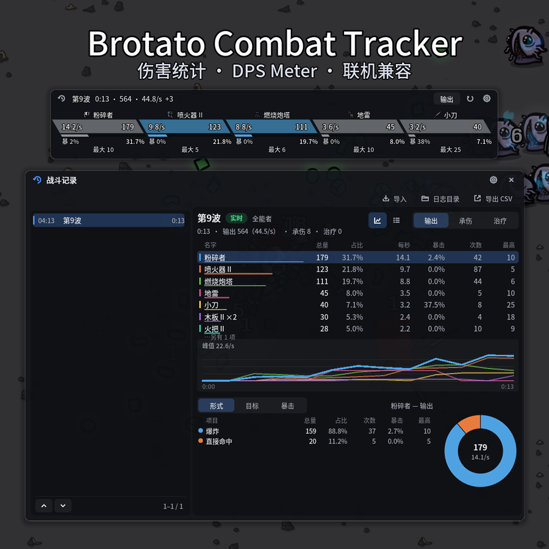

# Brotato Combat Tracker

**简体中文** | [English](README.en.md)

给 **Brotato（土豆兄弟）** 用的战斗统计面板。横向悬浮窗，按武器 / 物品拆分输出、承伤、治疗，
点开任一卡片可看命中形式、目标、暴击的环形图明细，按波次自动分段，可导出 CSV。
另有一个仿 ACT 的战斗记录窗口：每一波都能回看、能看逐条事件，每局的战斗事件自动存成日志，可以导入重新解析。
设置都能在游戏里改。界面文本跟随游戏语言。

**只读统计，不修改任何游戏数值。** 支持原版单机、本地合作（最多 4 人），
以及创意工坊的 [BrotatoOnline](https://steamcommunity.com/sharedfiles/filedetails/?id=3741034628) 联机 Mod。

当前适配：游戏 **1.1.15.4**（本体与 DLC Abyssal Terrors），Mod Loader **6.3.0**。



---

## 安装

### Steam：创意工坊订阅（推荐）

1. 打开[创意工坊页面](https://steamcommunity.com/sharedfiles/filedetails/?id=3809733696)（或在 Brotato 的创意工坊搜索 **Brotato Combat Tracker**），点「订阅」
2. 启动游戏。新订阅的 Mod 默认启用，也可以在主菜单的「模组」里开关

创意工坊会自动更新，不用管版本。

### 其它平台（GOG / Epic）

从 [Releases](https://github.com/DPS-Love/brotato-combat-tracker/releases/latest) 下载
`DPSLove-CombatTracker-vX.Y.Z.zip`，**不要解压**，放进游戏目录下的 `mods` 文件夹（没有就新建）：

```
Brotato\
├── Brotato.exe
└── mods\
    └── DPSLove-CombatTracker-vX.Y.Z.zip
```

> Steam 版的 Mod Loader 只加载订阅的创意工坊条目，不看 `mods` 文件夹。Steam 玩家请走创意工坊。

---

## 使用

| 按键 | 作用 |
|---|---|
| `F9` | 显示 / 隐藏浮窗 |
| `F8` | 打开 / 关闭战斗记录 |
| `F10` | 重置当前统计（同一波切出新的一段，旧的一段收进战斗记录） |
| `F11` | 把当前这一段导出成 CSV |

- 浮窗平时只有文字和卡片浮在游戏上（字带黑色描边）；鼠标移上去，半透明的背景和标题栏按钮才出现
- 浮窗标题栏：最左的记录图标打开战斗记录；右边依次是视图切换（**输出 / 承伤 / 治疗**，多人时还有 **来源 / 玩家**）、重置、设置
- **点击卡片**弹出拆分窗口，环形图 + 图例，图例超过 7 项时用滚轮翻：
  - 输出 · 来源：形式（直接命中 / 燃烧 / 爆炸 / 效果）、目标（打了哪些敌人）、暴击
  - 输出 · 玩家：来源（武器 / 物品）、类别（近战 / 远程 / 元素 / 工程…）、目标
  - 承伤：来源（被哪些敌人打）、结果（命中 / 闪避 / 抵挡）
  - 治疗：来源（生命再生 / 生命窃取 / 物品 / 消耗品…）
- 按波次自动分段，标题跟游戏一致，如「第 5 波 · 精英」；同一波失败后重打带序号「第 5 波 #2」
- 同名同品质的武器合成一张卡片，名字后面带把数，如「冲锋枪 III ×2」
- 窗口按住就能拖，位置会记住；图标按钮悬停一会儿有文字提示

浮窗只在波次进行中显示：暂停菜单、收波后的升级选择、商店里都会自动让开，免得挡住游戏自己的按钮。
想在波次之间看数据按 `F8`，战斗记录哪里都能开。战斗中游戏会把鼠标藏起来，暂停后再点面板最方便。

伤害默认**不计溢出**（打死怪时超出它剩余血量的部分），和游戏里武器伤害统计的口径一致；
想按原始伤害算，在设置里打开「计入溢出伤害」。

### 谁的伤害算谁的

| 情形 | 算在 |
|---|---|
| 武器命中、武器打出的弹道 | 那把武器 |
| 燃烧跳伤 | 点燃它的武器；物品给的全局燃烧算「受惊香肠」，无来源的工程学燃烧算「燃烧炮塔」 |
| 爆炸 | 触发它的武器（火箭筒、粉碎者、木板、动力拳…）或物品（地雷…） |
| 炮塔、地雷、宠物 | 对应的物品 |
| 闪避后的反击 | 「反击」 |
| 被魅惑的敌人造成的伤害 | 魅惑它的玩家，来源标「（魅惑）」 |

这些规则照着游戏自己的记账逻辑来，比如燃烧炮塔、受惊香肠在游戏里的伤害统计也是这么算的。
对树木的伤害默认不计（配置 `IncludeTrees`）。

### 战斗记录

浮窗标题栏最左的记录图标（或 `F8`）打开，形制参考 ACT 的主窗口：

- **左边**是本局的全部分段，最新的在上面；底部显示当前看到的是第几到第几段、一共多少段
- **右边**是选中那段的统计，进行中的那段标「实时」：输出 / 承伤 / 治疗的表格（总量、占比、每秒、暴击 / 闪避、次数、最高），
  多人时可按来源或按玩家分组；每一行每秒数值随时间变化的曲线（鼠标移上去看每一秒的数值）；以及拆分表和环形图。
  点表格里的一行只看它，再点一次或点空白处取消、回到全部；拆分表的行和环形图互相高亮，超过 8 项时用滚轮翻看，
  环上第 8 项之后的、占比太小画不出来的并成灰色的「其他」
- 右上角可以把下半截换成**逐条事件**：这一段的每一次伤害 / 承伤 / 治疗按时间排开（来源、目标、数值、暴击、形式），
  同样跟着视图和选中的行筛选。实时那段跟着最新的往下滚，已经结束的段和导入的日志从日志文件里读
- 顶部的「导出 CSV」导出选中的那段；「日志目录」打开存日志的文件夹

### 设置

浮窗或战斗记录标题栏上的齿轮打开：界面缩放、卡片斜切、窗口背景的浓淡、浮窗卡片数、图标、商店里显示浮窗、
是否计入溢出伤害和树木、战斗记录保留多少段、联机互传、战斗日志、热键、玩家颜色都能直接改，改完自动存进配置文件。
标着「重启后生效」的两项（战斗日志）下次启动游戏才生效。

### 战斗日志

每次游戏都会把战斗**事件**（每一次伤害、承伤、治疗、波次开始和结束…）写进一份日志：
`%APPDATA%\Brotato\CombatTracker\logs\bct-日期-时间.bctlog.gz`，标准 gzip，解压后逐行可读；默认保留 30 天。

战斗记录的「导入」可以打开任意一份日志，**按当前版本重新解析**——以后更新加了新的统计维度，旧日志导入也能看到。
别人的日志放进这个文件夹也能导入。格式说明见[战斗日志格式](docs/eventlog.md)。

---

## 联机

- **本地合作**：同一台机器上的所有玩家都统计。卡片名字前面带 `P1` / `P2`，左上角的小方块是玩家颜色
- **BrotatoOnline（创意工坊联机 Mod）**：联机时每台机器只模拟自己玩家的命中，没有哪一台机器看得到全队的伤害。
  所以每人只统计自己的玩家，每 2 秒通过 BrotatoOnline 公开的 Mod 消息接口把这一波的统计发给队友，
  收波时再发一次最终版。**队友也装了本 Mod 才看得到他的数据**，没装的队友就是空的，不影响其他人。
  房主、客机都一样；不想分享，在设置里关掉「联机互传统计」。逐条事件里只有本机玩家的（队友只传汇总）
- 队友的最终数据会写进你自己的战斗日志，日后导入也能看到整队

---

## 配置

`%APPDATA%\Brotato\CombatTracker\config.cfg`，**游戏启动一次后才会生成**，每项都有中英说明。
下面这些在游戏里的设置界面都能改；直接改文件的话要重启游戏。

| 配置项 | 默认 | 说明 |
|---|---|---|
| `ToggleOverlay` / `ToggleMainPanel` / `Reset` / `ExportCsv` | F9 / F8 / F10 / F11 | 热键，留空为不用 |
| `ShowOverlay` | true | 启动时显示浮窗 |
| `ShowInShop` | false | 商店里也显示浮窗（显示刚打完的那一波） |
| `UiScale` | 1.0 | 界面缩放 |
| `SkewDegrees` | -30 | 卡片斜切角度，`0` 为普通矩形 |
| `BackgroundOpacity` | 0.9 | 浮窗、拆分窗口和战斗记录背景的不透明度（0–1）；浮窗只在鼠标移上去时显示背景 |
| `MaxCards` | 5 | 浮窗最多几张卡片，其余计入标题栏的「+n」 |
| `ShowIcons` | true | 卡片上显示武器 / 物品图标 |
| `CountOverkill` | false | 伤害计入溢出 |
| `IncludeTrees` | false | 统计对树木的伤害 |
| `HistorySize` | 200 | 战斗记录里本局保留多少段，更早的仍在日志里；`0` 为不限 |
| `LogEvents` | true | 写战斗日志；关掉的话结束的段看不了逐条事件，也不能导入本局 |
| `LogRetentionDays` | 30 | 战斗日志保留天数，`0` 为永久保留 |
| `ShareStats` | true | 联机时与队友互传统计 |

`[Colors]` 段可以自定义四名玩家的颜色（设置界面里有一组预设色可选），也可以直接写十六进制值（`#RGB` / `#RRGGBB`），
留空用游戏里的玩家颜色。各窗口的位置由窗口自己写回配置。

---

## 卸载

在创意工坊取消订阅（或删掉 `mods` 里的 zip）。统计数据在 `%APPDATA%\Brotato\CombatTracker`，不要了可以一并删掉。

## 常见问题

**面板没出现** — 浮窗只在波次进行中显示；按 `F9` 确认没被隐藏；在主菜单「模组」里确认本 Mod 已启用。
还不行就看 `%APPDATA%\Brotato\logs\modloader.log` 里有没有 `DPSLove-CombatTracker`。

**Steam 版把 zip 放进 `mods` 不生效** — Steam 版只加载订阅的创意工坊条目，请走创意工坊。

**鼠标点不到面板** — 战斗中游戏会把鼠标藏起来（手柄 / 键盘操作、多人时）。暂停后再点；按 `F8` 打开战斗记录时也会把鼠标放出来。
浮窗的按钮只在鼠标移到浮窗上时才出现。

**和游戏里武器的「伤害」统计对不上** — 游戏的武器统计包含对树木的伤害，本 Mod 默认不计；
另外游戏会把一部分伤害同时记在武器和物品名下（比如受惊香肠的燃烧），本 Mod 每一点伤害只算一次。

**联机时看不到队友** — 队友也要装本 Mod，且双方都没关「联机互传统计」（`ShareStats`）。

**日志里有 `pd_player.gd` 找不到的报错** — Mod Loader 给 `player.gd` 装扩展时会顺带重载游戏开发时的测试类，
那个文件没打进游戏，报错无害。只要有 Mod 扩展 `player.gd` 就会出现（BrotatoOnline 也一样）。

**游戏更新后** — 本 Mod 只连游戏的信号、按字段识别游戏对象，一般不受更新影响；统计缺失时游戏本身不受影响，等新版本即可。

---

## 开发

构建、自动化测试、游戏更新后的重新对齐、发布到创意工坊的流程见 [docs/DEVELOPMENT.md](docs/DEVELOPMENT.md)。

## 许可与声明

[MIT 协议](LICENSE)。

本项目是 Brotato 的**非官方粉丝作品**，与开发商 Blobfish 无关，未获其背书。
游戏本身及其资产的权利归各自权利人所有；本项目只读取游戏运行时的可观测状态供玩家自用，
Mod 包里**不包含也不分发任何游戏资产**（面板上的武器图标、名字都是运行时从游戏里读的），文档里的游戏截图仅作展示。
